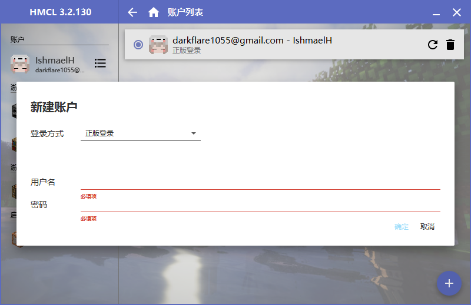
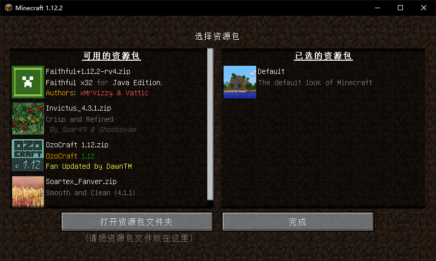

## 最近5次更新

### 2020/3/4

增加miniHUD

### 2020/2/24

mod不再使用forge，改为fabric，并增加mod

### 2019/12/18

使用1.14.4版本

只需要安装Mods1.14.4中的mod（不必要）

暂不提供材质包，提供一个光影包

## 下载

[百度云盘](https://pan.baidu.com/s/1D2z9xZw9aZEUp4Amzom0LQ)

不保证云盘中的README.md和ModList.md为最新，请以[GitHub](https://github.com/IshmaelHeathcliff/XYZMinecraft)处的文件为标准

## 基础安装

1.  进入游戏文件夹，打开HMCL.exe

2.  账户 => 右下角加号新建账户：离线模式为盗版

    

3.  游戏列表 => 安装新游戏版本 => 1.14.4=> 安装
4.  游戏 => 1.14.4 => 自动安装 => 在线安装fabric
5.  游戏 => 1.14.4 => 模组管理 => 添加模组：添加Mods1.14.4目录中的mod
6.  点击上方的主页按钮 => 右下角启动游戏

## 光影与材质

1.  将resourcepacks文件夹和shaderpacks文件夹放入.minecraft目录内

2.  启动游戏 => 选项... => 语言 => 拉到最下面，简体中文 => 完成

3.  资源包 => 选择一个 => 完成

    >   推荐XeKr的材质包，介绍请看[mcbbs](https://www.mcbbs.net/thread-823957-1-1.html)
    
    

1.  视频设置 => 光影 => 选择BSL => 右下角光影设置 => 配置文件:... => 完成

2.  最大帧率：无限制或60fps，根据实际情况调整

## 服务器

1.  多人游戏 => 添加服务器
2.  名称随意，服务器地址`39.107.64.72:25565` => 完成

## 皮肤

1.  将CustomSkinLoader文件夹放入.minecraft目录
2.  登录https://littleskin.cn/
3.  注册、验证等

## Mod

[Mod列表](mods/ModList.md)（未更新）

### 推荐mod设置

施工中

## 历史更新日志

### 2019/12/03

添加mod

1.  tinker_io
2.  StorageDrawer
3.  Cucumber
4.  LargeFluidTank
5.  Chameleon

删除mod

1.  Texfix
2.  foamfix

### 2019/11/28

重新开服

mod请重新安装下载链接中的2Gmods目录中的mod

### 2019/11/15

暂时停服

### 2019/11/12

添加mod

1.  AppleCore
2.  AppleSkin
3.  CookingForBlockheads
4.  jeibees
5.  pamscookables
6.  SpiceofLife

### 2019/11/11

添加mod

1.  just-enough-harvestcraft
2.  SmoothFont
3.  conarm
4.  Tinkers' Addons
5.  MmmMmmMmmMmm

更新mod

1.  TConstruct