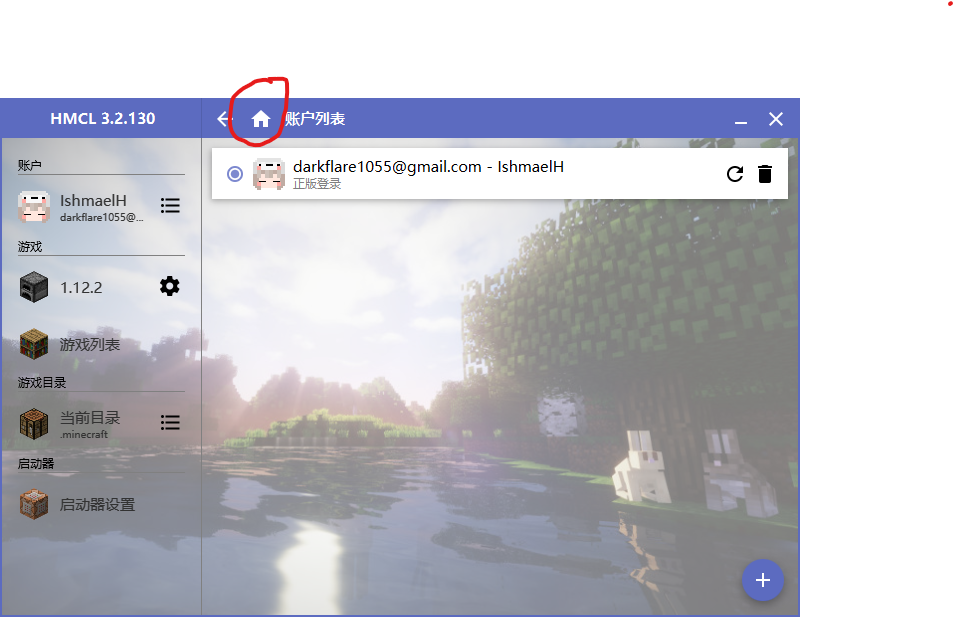

## 最近5次更新

### 2019/11/15

暂时停服

### 2019/11/12

添加mod

1.  AppleCore
2.  AppleSkin
3.  CookingForBlockheads
4.  jeibees
5.  pamscookables
6.  SpiceofLife

### 2019/11/11

添加mod

1.  just-enough-harvestcraft
2.  SmoothFont
3.  conarm
4.  Tinkers' Addons
5.  MmmMmmMmmMmm

更新mod

1.  TConstruct

## 下载

[百度云盘](https://pan.baidu.com/s/1D2z9xZw9aZEUp4Amzom0LQ)

不保证云盘中的README.md和ModList.md为最新，请以[GitHub](https://github.com/IshmaelHeathcliff/XYZMinecraft)处的文件为标准

## 基础安装

1.  进入游戏文件夹，打开HMCL.exe

2.  账户 => 右下角加号新建账户：离线模式为盗版

    

3.  游戏列表 => 安装新游戏版本 => 1.12.2 => 安装
4.  游戏 => 1.12.2 => 自动安装 => 在线安装：每次选择一个安装，Forge ***14.23.5.2825***，两外两个最新版
5.  游戏 => 1.12.2 => 模组管理 => 添加模组：添加mods目录下除servermods和optional以外的全部mod
6.  点击上方的主页按钮 => 右下角启动游戏

## 光影与材质

1.  将resourcepacks文件夹和shaderpacks文件夹放入.minecraft目录内

2.  启动游戏 => 选项... => 语言 => 拉到最下面，简体中文（会卡住一段时间）=> 完成

3.  资源包 => 选择一个，会卡住一段时间 => 完成

    >   不再建议ChromaHills，mod设置界面有问题
    >
    >   推荐OzoCraft

    

1.  视频设置 => 光影 => 选择一个，会卡住一段时间 => 完成

    >   Sildur吃资源少，Continuum效果更强，请根据实际情况调整
    >
    >   Continuum调整配置：右下角光影设置 => 配置文件:... => 完成

2.  最大帧率：无限制或60fps，根据实际情况调整

## 服务器

1.  多人游戏 => 添加服务器
2.  名称随意，服务器地址 `45.32.43.5:25565` => 完成

## 皮肤

1.  将CustomSkinLoader文件夹放入.minecraft目录
2.  登录https://littleskin.cn/
3.  注册、验证等

## Mod

[Mod列表](mods/ModList.md)

*JourneyMap已不推荐，请使用XaerosMinimap。若要继续使用JourneyMap请不要安装后者。*

### 推荐mod设置

施工中

## 历史更新日志